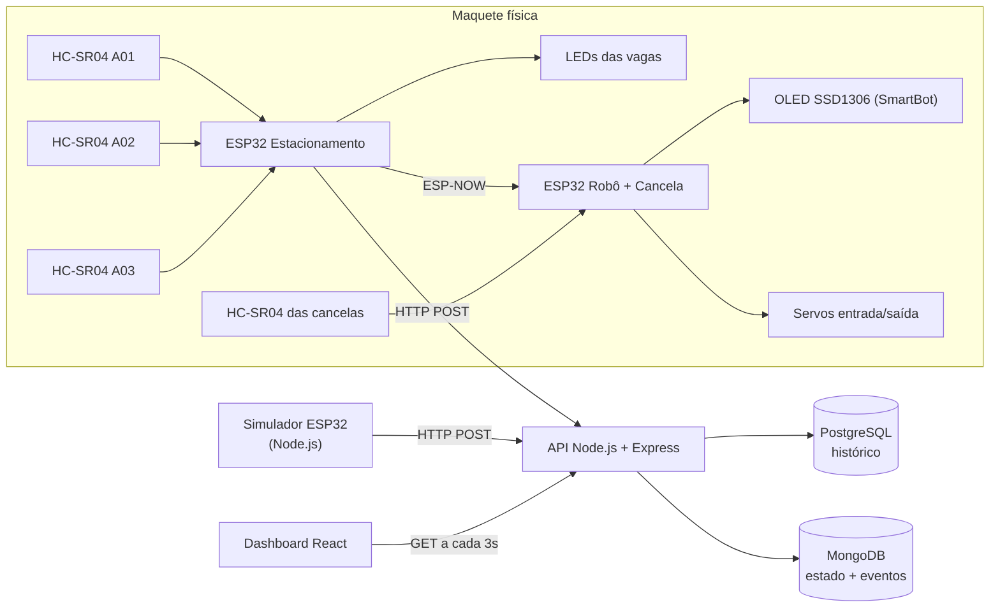
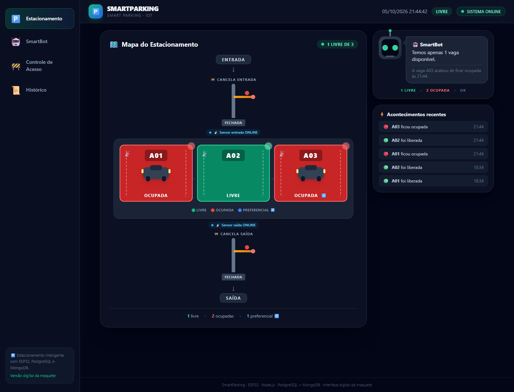
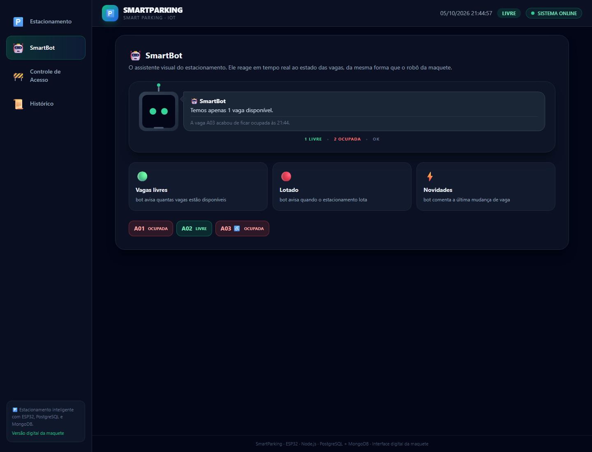
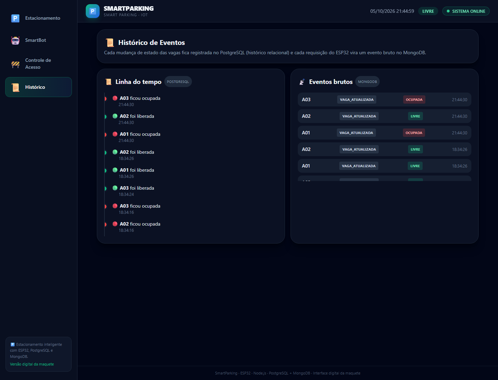

# 🚗 SmartParking

### Sistema Inteligente de Estacionamento

[](#-projeto-acad%C3%AAmico)
[](smartparking-firmware/)
[](smartparking-server/)
[](smartparking-dashboard/)
[](smartparking-server/)
[](smartparking-server/)
[](smartparking-server/docker-compose.yml)
[](LICENSE)

Estacionamento inteligente com monitoramento de 3 vagas (sendo uma preferencial), controle de cancelas de entrada e saida, robô com display OLED e dashboard web em tempo real.

O sistema integra uma **maquete física controlada por ESP32** a um **backend Node.js com dois bancos de dados** (relacional + NoSQL) e uma **interface web** que representa visualmente o estacionamento.

---

## 📖 Sobre o projeto

**Problema:** estacionamentos pequenos não têm visibilidade em tempo real da ocupação das vagas nem controle automatizado de acesso, o que gera filas, ocupação indevida de vagas preferenciais e falta de dados sobre o uso.

**Proposta:** uma maquete funcional de estacionamento inteligente que:

- detecta veículos nas 3 vagas com sensores ultrassônicos HC-SR04;
- sinaliza o estado de cada vaga com LEDs (A03 tem identificação azul de vaga preferencial);
- automatiza cancelas de entrada e saída com servos, liberando a entrada apenas quando há vagas;
- exibe informações em um display OLED com um robô animado ("SmartBot" físico);
- envia os dados via Wi-Fi para um servidor que os persiste em **PostgreSQL** (histórico relacional) e **MongoDB** (estado atual e eventos brutos);
- apresenta tudo em um **dashboard web** que funciona como a versão digital da maquete.

**Relação hardware × software:** o ESP32 do estacionamento é o nó sensor/atuador; comunicação local entre placas via **ESP-NOW** (robô/cancela) e comunicação com o servidor via **HTTP** (Wi-Fi). A API REST alimenta o dashboard React, que faz polling a cada 3 segundos.

---

## 🎯 Objetivos

### Objetivo geral

Desenvolver um sistema de estacionamento inteligente que una automação embarcada (ESP32), persistência de dados em bancos relacionais e não relacionais e visualização web em tempo real.

### Objetivos específicos

- Detectar ocupação de 3 vagas com sensores ultrassônicos e filtro de estabilidade;
- Diferenciar e sinalizar a vaga preferencial (A03) com LED azul;
- Automatizar cancelas de entrada/saída com servomotores, bloqueando a entrada quando lotado;
- Comunicar as placas ESP32 via ESP-NOW (baixa latência, sem roteador);
- Enviar mudanças de estado para um servidor por HTTP;
- Persistir o estado atual e eventos brutos no MongoDB e o histórico no PostgreSQL;
- Expor uma API REST e construir um dashboard com mapa visual das vagas, SmartBot, acesso e histórico.

---

## 🅿️ Funcionamento

1. O ESP32 do estacionamento mede cada vaga com 3 leituras ultrassônicas (média), a cada ciclo de ~1s;
2. Um **filtro de estabilidade** (2 confirmações) evita mudanças falsas de estado;
3. Quando uma vaga muda de estado (livre ↔ ocupada), o ESP32:
   - atualiza o LED da vaga (verde/vermelho; azul identifica a A03 preferencial);
   - envia **ESP-NOW** para o robô/cancela (`MSG_VAGA`) e `MSG_STATUS` (vagas livres);
   - envia **HTTP POST** para o servidor com `{ vaga, ocupada, preferencial, distanciaCm, macAddress }`;
4. O robô/cancela recebe, exibe no OLED e libera o LED indicador (verde = há vagas, vermelho = lotado);
5. Os sensores das cancelas detectam veículos: a **entrada** abre apenas se não estiver lotado; a **saída** abre sempre (fecham após 3s);
6. O servidor grava o estado no **MongoDB** (documento por vaga + evento bruto) e o histórico no **PostgreSQL** (uma linha por mudança);
7. O dashboard React consulta a API a cada 3 segundos e representa tudo visualmente (mapa, SmartBot, cancelas e timeline).

Fluxo de dados (Mermaid):



---

## 🚗 Vagas

| Vaga | Sensor | LED livre | LED ocupado | Preferencial |
|---|---|---|---|---|
| **A01** | HC-SR04 | Verde (GPIO 26) | Vermelho (GPIO 27) | Não |
| **A02** | HC-SR04 | Verde (GPIO 32) | Vermelho (GPIO 33) | Não |
| **A03** | HC-SR04 | **Azul** (GPIO 23) | Vermelho (GPIO 22) | **Sim ♿** |

Comportamento comum (extraído do firmware):

- Distância ≤ **8,0 cm** → vaga **ocupada**; acima disso → **livre**;
- Cada leitura é a **média de 3 medições** válidas;
- Mudança de estado exige **2 confirmações** consecutivas (filtro de estabilidade);
- Na mudança de estado são disparados: ESP-NOW (robô/cancela) + HTTP POST (servidor).

### A03 — Preferencial

- Identificada no dashboard com azul e símbolo ♿;
- LED **azul aceso = livre**; LED vermelho aceso = ocupada (a identificação preferencial permanece);
- O robô/cancela exibe o ícone de acessibilidade no OLED quando a mensagem é da A03.

---

## 🚧 Controle de acesso

| Item | Entrada | Saída |
|---|---|---|
| Sensor | HC-SR04 (TRIG 32 / ECHO 34) | HC-SR04 (TRIG 25 / ECHO 35) |
| Servo | GPIO 18 | GPIO 19 |
| Detecção | distância < 8,0 cm, 3 confirmações | idem |
| Abertura | apenas se **não** estiver lotado | **sempre** abre |
| Fechamento | automático após **3 s** | após 3 s |

- LEDs indicadores da cancela: verde (há vagas) / vermelho (lotado), GPIOs 26 e 27;
- O estado "lotado" chega via ESP-NOW (`MSG_LOTADO` / `MSG_LIBERADO` / `MSG_STATUS`);
- **No dashboard:** a tela "Controle de Acesso" é uma representação visual preparada para integração futura — o acionamento manual pela web ainda **não** está implementado (o controle é feito pela maquete via ESP-NOW).

---

## 🤖 SmartBot / OLED

O "SmartBot" existe em duas formas:

**1. Físico (maquete):** display OLED SSD1306 128×64 (I2C 0x3C) no ESP32 do robô/cancela, com um robô animado:

| Estado | Comportamento |
|---|---|
| NORMAL | Olhos com micro-movimentos, piscadas e troca de olhar |
| SURPRESO | Olhos arregalados por ~0,8–1,8 s |
| FELIZ | Olhos "sorrindo" por ~1,2–3 s |
| DORMINDO | Olhos fechados + "Z" animado (após 15 s sem eventos, por 8 s) |
| ACORDANDO | Olhos abrindo em etapas |

- Rodapé do display: **"Livres: X/3"** (atualizado por ESP-NOW);
- Mensagens exibidas quando chegam eventos: `A01 OCUPADA`, `A03 LIVRE` (com ícone ♿ para a preferencial), `LOTADO` e `LIBERADO` (em destaque, com moldura);
- As mensagens ficam ~3 s na tela (~6 s para LOTADO/LIBERADO).

**2. Digital (dashboard):** avatar com olhos que piscam e balão de fala com frases derivadas do **estado real** (ex.: *"Temos apenas 1 vaga disponível."*, *"Ops! O estacionamento está lotado."*) e da última mudança registrada no histórico.

---

## 📡 Comunicação

### ESP-NOW (entre placas, sem roteador)

- **Transmissor:** ESP32 do estacionamento;
- **Receptor:** ESP32 do robô + cancela;
- Estrutura da mensagem (`struct Mensagem`):

| Campo | Tipo | Descrição |
|---|---|---|
| `tipo` | uint8 | `MSG_VAGA`, `MSG_LOTADO`, `MSG_LIBERADO`, `MSG_STATUS` |
| `vaga` | char[5] | "A01"…"A03" |
| `estado` | char[12] | "OCUPADA" / "LIVRE" |
| `preferencial` | bool | true para A03 |
| `vagasLivres` | uint8 | 0–3 |

- `MSG_STATUS` é enviado a cada ciclo; `MSG_LOTADO`/`MSG_LIBERADO` apenas na transição.

### Wi-Fi + HTTP (ESP32 → servidor)

- O ESP32 do estacionamento conecta na rede Wi-Fi e envia `POST /api/vagas` com JSON;
- Reconexão automática a cada **5 s** sem bloquear o loop (`millis()`);
- Se o Wi-Fi cair, o **ESP-NOW continua funcionando** e os POSTs falham silenciosamente (apenas log serial);
- Ao reconectar, as 3 vagas são sincronizadas com o servidor;
- ⚠️ O robô/cancela também se conecta à mesma rede para permanecer no **mesmo canal** do ESP-NOW.

> Credenciais de rede, IP do servidor e MACs ficam em `config.h` **fora do controle de versão** (ver `config.example.h`). O repositório não publica esses dados.

---

## 🛠️ Tecnologias utilizadas

| Camada | Tecnologias |
|---|---|
| Firmware | ESP32 (Arduino/C++), ESP-NOW, Wi-Fi, HTTPClient, Adafruit GFX/SSD1306, ESP32Servo |
| Backend | Node.js, Express, `pg` (PostgreSQL), `mongodb` (driver oficial), dotenv, cors |
| Bancos | PostgreSQL 18 (relacional), MongoDB 7 via Docker (NoSQL) |
| Frontend | React 19, Vite, Tailwind CSS 3, Axios |
| Simulador | Node.js, Axios, Chalk, dotenv |
| Infra local | Docker Compose (MongoDB), npm |

---

## 🔌 Hardware

| Componente | Quantidade | Função |
|---|---|---|
| ESP32 DevKitC (WROOM-32) | 2 | Estacionamento (1) e Robô + Cancela (1) |
| Sensor ultrassônico HC-SR04 | 5 | 3 vagas + entrada + saída |
| Servo motor (SG90) | 2 | Cancelas de entrada e saída |
| Display OLED SSD1306 0.96" (I2C) | 1 | SmartBot (olhos e mensagens) |
| LED verde | 2 | Vagas A01 e A02 livres + indicador da cancela |
| LED azul | 1 | Identificação da vaga preferencial A03 |
| LED vermelho | 3 | Vagas ocupadas (A01/A02/A03) + indicador "lotado" |
| Protoboard, jumpers, fonte/alimentação | — | Montagem da maquete |

> Valores extraídos do firmware (`smartparking-firmware/`).

### Ligações principais (GPIOs)

**Vagas (ESP32 estacionamento):**

| Vaga | TRIG | ECHO | LED livre | LED ocupado |
|---|---|---|---|---|
| A01 | 25 | 34 | 26 (verde) | 27 (vermelho) |
| A02 | 14 | 35 | 32 (verde) | 33 (vermelho) |
| A03 | 13 | 36 | 23 (azul) | 22 (vermelho) |

**Robô + Cancela (ESP32):**

| Dispositivo | GPIO |
|---|---|
| Servo da entrada | 18 |
| Servo da saída | 19 |
| HC-SR04 entrada (TRIG / ECHO) | 32 / 34 |
| HC-SR04 saída (TRIG / ECHO) | 25 / 35 |
| LED indicador verde | 26 |
| LED indicador vermelho | 27 |
| OLED I2C (SDA / SCL) | 21 / 22 |

---

## 🖥️ Frontend

Dashboard React que **não é um painel administrativo**: a tela principal é um **mapa vivo do estacionamento** (a versão digital da maquete).

| Tela | Conteúdo |
|---|---|
| 🅿️ **Estacionamento** (padrão) | Entrada → cancela → vagas A01/A02/A03 (com carros, LEDs pulsando e sensores) → cancela → saída. Vaga clicável abre painel com sensor, distância real, última leitura e MAC do ESP32. SmartBot e acontecimentos recentes ao lado. |
| 🤖 **SmartBot** | Avatar com olhos que piscam e falas contextuais baseadas no estado real. |
| 🚧 **Controle de Acesso** | Cancelas de entrada/saída, estado e sensores (visual preparado; sem controle remoto ainda). |
| 📜 **Histórico** | Linha do tempo (PostgreSQL) + eventos brutos (MongoDB). |

- Atualização automática via **polling de 3 s** (reconexão a cada 5 s em caso de erro);
- Indicador de conexão ("SISTEMA ONLINE"), tema escuro (slate), animações leves (LED pulsando, carro surgindo, cancela girando, olhos do bot piscando) feitas com CSS/Tailwind, sem bibliotecas pesadas.

---

## 🔌 API (Backend)

Base: `http://localhost:3000`

| Método | Rota | Descrição | Fonte dos dados |
|---|---|---|---|
| `GET` | `/api/vagas` | Estado atual das 3 vagas (+ sensores e metadata) | MongoDB |
| `POST` | `/api/vagas` | Atualiza uma vaga e registra histórico + evento | PostgreSQL + MongoDB |
| `GET` | `/api/status` | Resumo (`lotado`, `totalLivres`, `totalOcupadas`) | MongoDB |
| `GET` | `/api/historico?limite=20` | Histórico de ocupação | PostgreSQL |
| `GET` | `/api/eventos?limite=20&vaga=A01` | Eventos brutos recebidos do ESP32 | MongoDB |

Exemplo de POST (o que o ESP32 envia):

```json
{
  "vaga": "A01",
  "ocupada": true,
  "preferencial": false,
  "distanciaCm": 5.2,
  "macAddress": "XX:XX:XX:XX:XX:XX"
}
```

**Resiliência:** se o MongoDB cair, `/api/vagas` responde `503` com fallback em memória; se o PostgreSQL cair, o histórico responde `503` mas o estado continua disponível; se ambos caírem, o sistema usa a memória e avisa no header.

---

## 🗄️ Banco de dados

### PostgreSQL (relacional) — histórico

| Tabela | Colunas |
|---|---|
| `vagas` | `id` (PK), `codigo` (UNIQUE), `preferencial`, `ocupada`, `criado_em`, `atualizado_em` |
| `historico_ocupacao` | `id` (PK), `vaga_id` (FK → `vagas.id`), `ocupada`, `timestamp` |

Uma linha de histórico por mudança de estado (integridade referencial, JOINs e rastreabilidade temporal).

### MongoDB (NoSQL) — estado atual + eventos

| Coleção | Conteúdo |
|---|---|
| `estado_vagas` | Um documento por vaga: `codigo` (índice único), `ocupada`, `preferencial`, `ultimaAtualizacao`, `sensores { distanciaCm, ultimaLeitura }`, `metadata { macAddress }` |
| `eventos_brutos` | Um documento por requisição do ESP32: `tipo`, `vaga`, `ocupada`, `preferencial`, `timestamp`, `payloadOriginal` (JSON exato recebido), `ipOrigem`; índices em `timestamp` e `vaga` |

Justificativa da divisão: dados estruturados/relacionais (histórico, integridade) no PostgreSQL; dados flexíveis e de alta escrita (estado atual mutável e eventos brutos com estrutura variável) no MongoDB. O padrão de **fallback em memória** garante operação mesmo com os bancos fora do ar.

---

## 📁 Estrutura do projeto

```
SmartParking/
├── smartparking-firmware/          # Firmware ESP32 (Arduino/C++)
│   ├── estacionamento/             #   Sketch do estacionamento (+ config.h local)
│   ├── robo_cancela/               #   Sketch do robô + cancelas
│   └── exemplo_generico/           #   Firmware de exemplo comentado
├── smartparking-server/            # Backend Node.js + Express
│   ├── src/
│   │   ├── server.js
│   │   ├── routes/vagas.js
│   │   ├── controllers/vagasController.js
│   │   ├── services/vagasService.js
│   │   ├── repositories/           #   vagasRepository (SQL) + vagasMongoRepository
│   │   ├── database/               #   connection.js, mongoConnection.js, schema.sql
│   │   └── data/vagasMemoria.js    #   Fallback em memória
│   └── docker-compose.yml          # MongoDB em container
├── smartparking-simulador/         # Simulador do ESP32 (Node.js)
├── smartparking-dashboard/         # Dashboard React + Vite + Tailwind
│   └── src/
│       ├── pages/                  #   Estacionamento, SmartBot, Acesso, Histórico
│       ├── components/             #   parking/, smartbot/, access/, history/, layout/
│       ├── hooks/usePolling.js
│       └── services/api.js
├── docs/images/                    # Screenshots (para este README)
├── README.md
└── .gitignore
```

---

## 🚀 Como executar

### Pré-requisitos

- Node.js 18+ e npm
- PostgreSQL 18 em execução
- Docker (para o MongoDB) — ou MongoDB instalado localmente
- Arduino IDE + core ESP32 (apenas para o hardware)

### 1. Backend (`smartparking-server`)

```bash
cd smartparking-server
npm install

# MongoDB em container (cria as coleções/índices na primeira vez)
docker compose up -d
docker exec smartparking-mongodb mongosh --eval "db = db.getSiblingDB('smartparking_nosql'); db.createCollection('estado_vagas'); db.createCollection('eventos_brutos'); db.estado_vagas.createIndex({ codigo: 1 }, { unique: true }); db.eventos_brutos.createIndex({ timestamp: -1 }); db.eventos_brutos.createIndex({ vaga: 1 });"

# PostgreSQL (cria banco, tabelas e seed)
psql -U postgres -f src/database/schema.sql

# Configuração
cp .env.example .env    # preencha com seus dados

npm run dev             # http://localhost:3000
```

### 2. Simulador do ESP32 (`smartparking-simulador`) — opcional, para testes sem hardware

```bash
cd smartparking-simulador
npm install
cp .env.example .env
node simulador.js sequencial   # ou: aleatorio | manual | carga | cenario
```

### 3. Dashboard (`smartparking-dashboard`)

```bash
cd smartparking-dashboard
npm install
cp .env.example .env
npm run dev             # http://localhost:5173
```

### 4. Firmware ESP32 (`smartparking-firmware`) — hardware real

1. Copie `config.example.h` para `config.h` em cada sketch e preencha (Wi-Fi, IP do servidor e MACs);
2. Abra a pasta do sketch no Arduino IDE (ex.: `estacionamento/`), placa **ESP32 Dev Module**;
3. Grave e acompanhe pelo Serial Monitor (115200).

Instruções completas: [`smartparking-firmware/README.md`](smartparking-firmware/README.md)

---

## 🧪 Testes

O projeto **não possui testes automatizados** no momento (há validação manual documentada via `curl` nos READMEs e um simulador com modos de estresse).

Testes manuais sugeridos:

```bash
# Estado atual
curl.exe http://localhost:3000/api/vagas

# Simular o ESP32 (arquivo body.json: {"vaga":"A01","ocupada":true,"preferencial":false})
curl.exe -X POST http://localhost:3000/api/vagas -H "Content-Type: application/json" -d "@body.json"

# Histórico e eventos
curl.exe "http://localhost:3000/api/historico?limite=10"
curl.exe "http://localhost:3000/api/eventos?limite=10&vaga=A01"
```

---

## 🖼️ Demonstração

> Espaço reservado para screenshots reais (a serem adicionadas em `docs/images/`):

```markdown



```

## 🎥 Demonstração em vídeo

👉 TODO: inserir o link do vídeo de demonstração.

---

## 📚 Projeto acadêmico

Projeto desenvolvido no **Instituto Federal de Pernambuco (IFPE) — Campus Garanhuns**, no curso de **Análise e Desenvolvimento de Sistemas**, integrando três disciplinas:

| Disciplina | Professor(a) |
|---|---|
| Sistemas Embarcados | Lauro André |
| Programação Web 2 | Jair Galvão |
| Banco de Dados 2 | Paulo André |

O trabalho explora, de forma integrada: **sistemas embarcados** (ESP32, sensores, servos, OLED e comunicação ESP-NOW/Wi-Fi), **desenvolvimento web** (API Node.js/Express e dashboard React) e **bancos de dados** (relacional PostgreSQL + não relacional MongoDB no mesmo sistema).

### 👥 Integrantes

| Integrante | GitHub |
|---|---|
| Alberto Breno | *(TODO)* |
| Arthur Padilha | *(TODO)* |
| Bruno Gomes | [@Brunogfv](https://github.com/Brunogfv) |
| Leandro Machado | *(TODO)* |

---

## 🔮 Status e próximos passos

**Implementado:**

- ✅ Firmware do estacionamento (sensores, LEDs, filtro de estabilidade, ESP-NOW + Wi-Fi/HTTP)
- ✅ Firmware do robô + cancelas (OLED, animações, 2 servos, 2 sensores, bloqueio quando lotado)
- ✅ Backend com API REST, PostgreSQL + MongoDB e fallback em memória
- ✅ Simulador do ESP32 com 5 modos de operação
- ✅ Dashboard com mapa visual, SmartBot, acesso e histórico (polling 3 s)

**Melhorias futuras (não implementadas):**

- Controle manual das cancelas pela web (exige novo comando no firmware/API);
- Autenticação e perfis de acesso no dashboard;
- Testes automatizados (API, componentes e firmware);
- Aplicativo mobile e notificações push;
- Estatísticas avançadas (taxa de ocupação por período, tempo médio de permanência);
- Reconhecimento de placas / reserva de vagas;
- Mais vagas e sensores adicionais;
- Deploy do backend e dashboard em nuvem.

---

## 📄 Licença

Este projeto está licenciado sob a licença **MIT** — veja o arquivo [LICENSE](LICENSE).
